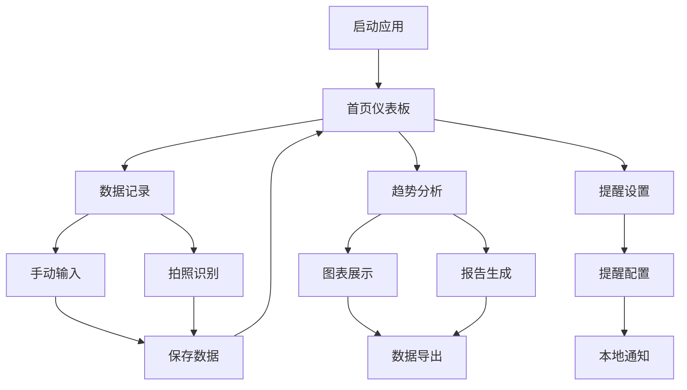

## 1. 产品概述
专注于健康生活方式的跨平台血压数据管理应用，帮助用户便捷记录、追踪和分析血压数据。通过智能提醒、数据可视化和OCR识别技术，让用户更好地管理心血管健康，并为医疗咨询提供专业的数据支持。

目标用户：关注心血管健康的中老年人群、高血压患者、健康管理意识强的用户。

技术特色：基于React Native (TypeScript)开发，支持Android、iOS和鸿蒙系统，一次开发多端运行。

## 2. 核心功能

### 2.1 用户角色
| 角色 | 注册方式 | 核心权限 |
|------|----------|----------|
| 普通用户 | 本地使用，无需注册 | 完整使用所有功能，数据本地存储 |

### 2.2 功能模块
血压管理应用包含以下核心页面：
1. **首页仪表板**：血压趋势概览、快速记录入口、最近测量数据
2. **数据记录页**：手动输入、拍照识别、历史记录列表
3. **趋势分析页**：交互式图表、时间筛选、健康报告
4. **提醒设置页**：测量提醒配置、通知管理
5. **数据导出页**：报告生成、数据分享、导出格式选择

### 2.3 页面详情
| 页面名称 | 模块名称 | 功能描述 |
|----------|----------|----------|
| 首页仪表板 | 趋势概览 | 显示最近7天血压变化趋势图表，包含收缩压/舒张压/脉搏数据 |
| 首页仪表板 | 快速记录 | 提供一键进入手动输入和拍照识别的入口按钮 |
| 首页仪表板 | 最近数据 | 展示最新3条测量记录，包含时间、数值和状态指示 |
| 数据记录页 | 手动输入 | 提供表单输入收缩压、舒张压、脉搏数值，支持添加备注 |
| 数据记录页 | 拍照识别 | 调用相机拍摄血压计屏幕，OCR自动识别数值 |
| 数据记录页 | 历史列表 | 按时间倒序展示所有测量记录，支持滑动删除 |
| 趋势分析页 | 交互图表 | 提供日线/周线/月线三种视图，支持手势缩放和滑动 |
| 趋势分析页 | 健康报告 | 基于测量数据生成血压分类分析（正常/偏高/高血压） |
| 趋势分析页 | 数据统计 | 显示平均值、最高值、最低值等统计信息 |
| 提醒设置页 | 提醒配置 | 设置每日测量时间、提醒频率（单次/多次）、提醒方式 |
| 提醒设置页 | 通知管理 | 开启/关闭提醒、设置提醒铃声和震动模式 |
| 数据导出页 | 报告生成 | 生成PDF格式的专业健康报告，包含图表和分析 |
| 数据导出页 | 数据分享 | 支持通过邮件、微信等方式分享报告给医生或家人 |

## 3. 核心流程

### 用户主要操作流程：
1. **首次使用流程**：打开应用 → 查看欢迎引导 → 进入首页 → 点击快速记录 → 手动输入第一条血压数据 → 查看趋势图表

2. **日常记录流程**：首页点击记录 → 选择手动输入或拍照识别 → 输入/识别数值 → 确认保存 → 返回查看更新后的趋势

3. **数据分析流程**：进入趋势分析页 → 选择时间范围 → 查看图表变化 → 阅读健康报告 → 导出分享

4. **提醒设置流程**：进入提醒设置 → 添加提醒时间 → 设置提醒频率 → 开启通知权限 → 完成配置

## 4. 用户界面设计

### 4.1 设计风格
- **主色调**：医疗蓝（#1976D2）搭配白色背景，营造专业可信的医疗氛围
- **强调色**：健康绿（#4CAF50）用于正常状态指示，警告橙（#FF9800）用于偏高提醒，危险红（#F44336）用于高血压警示
- **按钮样式**：圆角矩形设计，遵循Material Design 3规范，主要操作为填充按钮，次要操作为 outlined 按钮
- **字体系统**：使用Roboto字体家族，标题18sp，正文14sp，辅助文字12sp
- **布局风格**：卡片式布局，内容模块化展示，重要信息突出显示
- **图标风格**：使用Material Design图标库，线性图标为主，状态图标采用面性设计

### 4.2 页面设计概述
| 页面名称 | 模块名称 | UI元素 |
|----------|----------|----------|
| 首页仪表板 | 趋势概览 | 全宽卡片展示折线图，使用MPAndroidChart，收缩压红色线条，舒张压蓝色线条，背景浅灰色网格 |
| 首页仪表板 | 快速记录 | 底部悬浮操作按钮（FAB），蓝色背景配白色加号图标，点击展开手动输入和拍照识别两个选项 |
| 数据记录页 | 手动输入 | 三个圆形输入框垂直排列，分别标注收缩压/舒张压/脉搏，下方为备注输入框和保存按钮 |
| 数据记录页 | 拍照识别 | 相机预览界面，中央透明框标识识别区域，底部拍照按钮，顶部切换手动输入的图标 |
| 趋势分析页 | 交互图表 | 全屏图表，顶部时间筛选器（日/周/月），支持手势缩放，数据点点击显示详细信息 |
| 提醒设置页 | 提醒配置 | 时间选择器使用Material TimePicker，频率选项使用单选按钮组，保存按钮固定在底部 |

### 4.3 响应式设计
- **移动端优先**：专为手机设计，适配5-7英寸屏幕，支持Android、iOS、鸿蒙系统
- **屏幕适配**：支持竖屏为主，横屏模式下图表全屏展示
- **触摸优化**：所有交互元素最小触摸区域48dp，支持滑动手势操作
- **性能优化**：启动时间控制在2秒内，页面切换动画流畅无卡顿

### 4.4 深色模式
- **深色主题**：背景使用深灰色（#121212），卡片使用稍浅灰色（#1E1E1E）
- **色彩调整**：主色调保持不变，文字使用高对比度白色或浅灰色
- **图像处理**：图表线条颜色在深色模式下适当调亮，保持可读性
- **自动切换**：支持跟随系统设置自动切换，也提供手动切换选项

## 5. 技术要求

### 5.1 开发框架
- **前端框架**: React Native 0.73+ (TypeScript)
- **UI库**: React Native Paper (Material Design 3)
- **导航**: React Navigation 6.x
- **状态管理**: Zustand
- **图表库**: Victory Native XL (基于React Native Skia)

### 5.2 数据存储
- **本地数据库**: WatermelonDB (SQLite) 或 Realm
- **数据加密**: AES-256加密，密钥存储在React Native Keychain
- **数据备份**: 支持导出到PDF和CSV格式

### 5.3 设备功能
- **OCR识别**: react-native-mlkit-ocr，支持血压计数字识别
- **相机功能**: react-native-image-picker，支持拍照和相册选择
- **本地通知**: react-native-push-notification，支持定时提醒
- **生物识别**: react-native-touch-id，支持指纹/面部识别

### 5.4 跨平台支持
- **Android**: API 24+ (Android 7.0+)
- **iOS**: iOS 12.0+
- **鸿蒙**: 支持HarmonyOS 3.0+ (通过RNOH)

### 5.5 性能要求
- **启动时间**: ≤ 2秒
- **页面切换**: ≤ 300ms
- **图表渲染**: ≤ 500ms (1000条数据)
- **内存占用**: ≤ 150MB (典型使用场景)
- **安装包大小**: Android ≤ 25MB，iOS ≤ 30MB