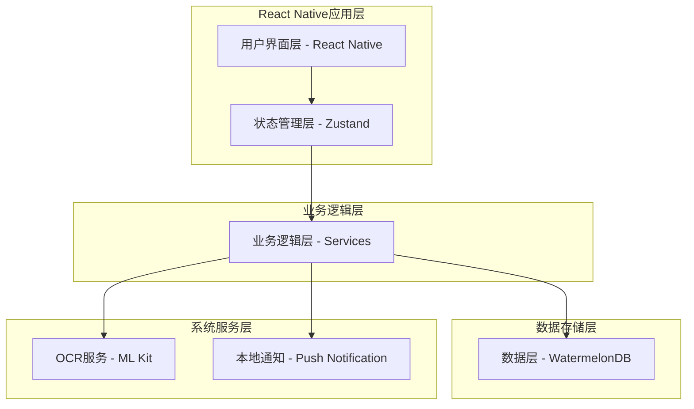
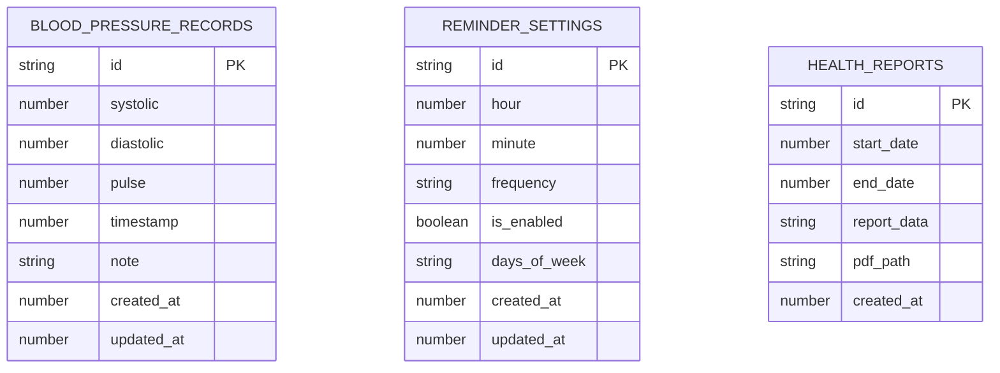

## 1. 架构设计



## 2. 技术描述

- **开发语言**: TypeScript 5.0+
- **UI框架**: React Native 0.73+ + React Native Paper (Material Design 3)
- **架构模式**: 模块化架构 (Feature-based)
- **状态管理**: Zustand
- **数据库**: WatermelonDB (SQLite) 或 Realm
- **图表库**: Victory Native XL (React Native Skia)
- **OCR识别**: react-native-mlkit-ocr
- **导航**: React Navigation 6.x
- **日期处理**: date-fns
- **构建工具**: React Native CLI / Expo
- **跨平台**: Android, iOS, HarmonyOS (RNOH支持)
- **类型安全**: TypeScript严格模式

## 3. 模块架构

### 3.1 功能模块 (Features)
```
src/
├── features/                 # 功能模块
│   ├── bloodPressure/       # 血压数据管理
│   │   ├── screens/         # 页面组件
│   │   │   ├── HomeScreen.tsx
│   │   │   ├── RecordScreen.tsx
│   │   │   └── AnalysisScreen.tsx
│   │   ├── components/      # 功能组件
│   │   │   ├── BloodPressureCard.tsx
│   │   │   ├── ManualInputForm.tsx
│   │   │   └── CameraCapture.tsx
│   │   ├── store/          # 状态管理
│   │   │   └── bloodPressureStore.ts
│   │   └── types/          # 类型定义
│   │       └── bloodPressure.types.ts
│   ├── reminders/          # 提醒功能
│   │   ├── screens/
│   │   │   └── ReminderScreen.tsx
│   │   ├── components/
│   │   │   └── ReminderForm.tsx
│   │   └── store/
│   │       └── reminderStore.ts
│   └── reports/            # 报告导出
│       ├── screens/
│       │   └── ExportScreen.tsx
│       └── components/
│           └── ReportGenerator.tsx
```

### 3.2 核心组件 (Components)
```
src/components/               # 通用组件
├── common/                  # 基础组件
│   ├── Button.tsx
│   ├── Card.tsx
│   ├── Input.tsx
│   └── Loading.tsx
├── charts/                  # 图表组件
│   ├── BloodPressureChart.tsx
│   └── TrendAnalysis.tsx
├── navigation/              # 导航组件
│   ├── TabNavigator.tsx
│   └── StackNavigator.tsx
└── ui/                      # UI组件
    ├── ThemeProvider.tsx
    └── MaterialComponents.tsx
```

### 3.3 服务层 (Services)
```
src/services/                # 业务服务
├── database/                # 数据库服务
│   ├── DatabaseService.ts
│   ├── BloodPressureRepository.ts
│   └── Repository.types.ts
├── ocr/                     # OCR服务
│   ├── OCRService.ts
│   └── MLKitOCR.ts
├── notification/              # 通知服务
│   ├── NotificationService.ts
│   └── ReminderManager.ts
├── export/                  # 导出服务
│   ├── ExportService.ts
│   └── PDFGenerator.ts
└── utils/                   # 工具函数
    ├── DataValidator.ts
    ├── DateFormatter.ts
    └── ChartHelpers.ts
```

### 3.4 配置与类型 (Config & Types)
```
src/
├── types/                    # 全局类型定义
│   ├── models.ts
│   ├── navigation.ts
│   └── api.ts
├── config/                   # 应用配置
│   ├── app.config.ts
│   ├── theme.ts
│   └── constants.ts
└── store/                    # 全局状态
    ├── rootStore.ts
    └── appStore.ts
```

## 4. 数据模型定义

### 4.1 血压记录接口
```typescript
export interface BloodPressureRecord {
  id: string;
  systolic: number;      // 收缩压
  diastolic: number;     // 舒张压
  pulse: number;         // 脉搏
  timestamp: number;     // 测量时间戳
  note?: string;         // 备注
  createdAt: number;     // 创建时间
  updatedAt?: number;    // 更新时间
}

export interface BloodPressureRecordDB {
  id: string;
  systolic: number;
  diastolic: number;
  pulse: number;
  timestamp: number;
  note?: string;
  created_at: number;
  updated_at?: number;
}
```

### 4.2 血压状态枚举
```typescript
export enum BloodPressureCategory {
  NORMAL = 'normal',                    // 正常
  ELEVATED = 'elevated',               // 偏高
  HIGH_STAGE_1 = 'high_stage_1',       // 高血压一期
  HIGH_STAGE_2 = 'high_stage_2',       // 高血压二期
  HYPERTENSIVE_CRISIS = 'hypertensive_crisis' // 高血压危象
}

export interface BloodPressureStatus {
  category: BloodPressureCategory;
  systolicStatus: 'normal' | 'warning' | 'danger';
  diastolicStatus: 'normal' | 'warning' | 'danger';
  description: string;
}
```

### 4.3 提醒配置接口
```typescript
export interface ReminderSettings {
  id: string;
  hour: number;          // 提醒小时 (0-23)
  minute: number;        // 提醒分钟 (0-59)
  frequency: ReminderFrequency;  // 提醒频率
  isEnabled: boolean;    // 是否启用
  daysOfWeek?: number[]; // 每周哪几天 (0-6, 0为周日)
  createdAt: number;
  updatedAt?: number;
}

export enum ReminderFrequency {
  DAILY = 'daily',        // 每日
  WEEKLY = 'weekly',      // 每周
  CUSTOM = 'custom'       // 自定义
}

export interface ReminderTime {
  id: string;
  time: string;            // HH:MM 格式
  label: string;           // 提醒标签
  isActive: boolean;
}
```

## 5. 数据库设计

### 5.1 数据库架构


### 5.2 WatermelonDB 模型定义
```typescript
// BloodPressureModel.ts
import { Model } from '@nozbe/watermelondb';
import { field, date, readonly, action } from '@nozbe/watermelondb/decorators';

export default class BloodPressureModel extends Model {
  static table = 'blood_pressure_records';

  @field('systolic') systolic!: number;
  @field('diastolic') diastolic!: number;
  @field('pulse') pulse!: number;
  @date('timestamp') timestamp!: number;
  @field('note') note?: string;
  
  @readonly @date('created_at') createdAt!: number;
  @readonly @date('updated_at') updatedAt!: number;

  @action async updateRecord(systolic: number, diastolic: number, pulse: number, note?: string) {
    await this.update(record => {
      record.systolic = systolic;
      record.diastolic = diastolic;
      record.pulse = pulse;
      record.note = note || '';
    });
  }
}

// ReminderModel.ts
import { Model } from '@nozbe/watermelondb';
import { field, date, readonly } from '@nozbe/watermelondb/decorators';

export default class ReminderModel extends Model {
  static table = 'reminder_settings';

  @field('hour') hour!: number;
  @field('minute') minute!: number;
  @field('frequency') frequency!: string;
  @field('is_enabled') isEnabled!: boolean;
  @field('days_of_week') daysOfWeek!: string; // JSON string array
  
  @readonly @date('created_at') createdAt!: number;
  @readonly @date('updated_at') updatedAt!: number;
}
```

## 6. 核心功能实现

### 6.1 OCR识别流程
```typescript
// OCRService.ts
import { MlkitOcr } from 'react-native-mlkit-ocr';
import { ImagePickerResponse } from 'react-native-image-picker';

export class OCRService {
  private mlkitOCR: MlkitOcr;

  constructor() {
    this.mlkitOCR = new MlkitOcr();
  }

  async recognizeBloodPressureFromImage(imagePath: string): Promise<OCRResult> {
    try {
      // 使用ML Kit识别图片中的文字
      const result = await this.mlkitOCR.detectFromUri(imagePath);
      
      if (!result || result.length === 0) {
        return { success: false, error: '未识别到文字' };
      }

      // 提取所有识别的文字
      const detectedText = result.map(block => block.text).join(' ');
      
      // 解析数字
      const numbers = this.extractNumbers(detectedText);
      
      if (numbers.length < 3) {
        return { success: false, error: '未识别到足够的血压数据' };
      }

      return this.validateAndCreateBloodPressure(numbers);
    } catch (error) {
      return { success: false, error: `识别失败: ${error.message}` };
    }
  }

  private extractNumbers(text: string): number[] {
    const regex = /\d{2,3}/g;
    const matches = text.match(regex);
    return matches ? matches.map(Number) : [];
  }

  private validateAndCreateBloodPressure(numbers: number[]): OCRResult {
    const [systolic, diastolic, pulse] = numbers;
    
    // 基础验证
    if (systolic < 70 || systolic > 250 || 
        diastolic < 40 || diastolic > 150 ||
        pulse < 40 || pulse > 200) {
      return { success: false, error: '识别到的数值超出正常范围' };
    }

    return {
      success: true,
      data: { systolic, diastolic, pulse }
    };
  }
}

interface OCRResult {
  success: boolean;
  data?: { systolic: number; diastolic: number; pulse: number };
  error?: string;
}
```

### 6.2 数据验证逻辑
```typescript
// DataValidator.ts
export class DataValidator {
  static validateBloodPressure(
    systolic: number, 
    diastolic: number, 
    pulse: number
  ): ValidationResult {
    // 范围验证
    if (systolic < 70 || systolic > 250) {
      return {
        isValid: false,
        error: '收缩压应在70-250之间'
      };
    }

    if (diastolic < 40 || diastolic > 150) {
      return {
        isValid: false,
        error: '舒张压应在40-150之间'
      };
    }

    if (pulse < 40 || pulse > 200) {
      return {
        isValid: false,
        error: '脉搏应在40-200之间'
      };
    }

    // 逻辑验证
    if (systolic <= diastolic) {
      return {
        isValid: false,
        error: '收缩压应大于舒张压'
      };
    }

    return { isValid: true };
  }

  static getBloodPressureCategory(systolic: number, diastolic: number): BloodPressureCategory {
    if (systolic >= 180 || diastolic >= 120) {
      return BloodPressureCategory.HYPERTENSIVE_CRISIS;
    }
    if (systolic >= 140 || diastolic >= 90) {
      return BloodPressureCategory.HIGH_STAGE_2;
    }
    if (systolic >= 130 || diastolic >= 80) {
      return BloodPressureCategory.HIGH_STAGE_1;
    }
    if (systolic >= 120) {
      return BloodPressureCategory.ELEVATED;
    }
    return BloodPressureCategory.NORMAL;
  }
}

interface ValidationResult {
  isValid: boolean;
  error?: string;
}
```

### 6.3 本地通知实现
```typescript
// NotificationService.ts
import PushNotification from 'react-native-push-notification';
import { Platform } from 'react-native';

export class NotificationService {
  constructor() {
    this.initializeNotifications();
  }

  private initializeNotifications() {
    PushNotification.configure({
      onRegister: function (token) {
        console.log('TOKEN:', token);
      },
      onNotification: function (notification) {
        console.log('NOTIFICATION:', notification);
      },
      permissions: {
        alert: true,
        badge: true,
        sound: true,
      },
      popInitialNotification: true,
      requestPermissions: Platform.OS === 'ios',
    });
  }

  scheduleReminder(reminder: ReminderSettings): void {
    const { hour, minute, frequency, isEnabled } = reminder;

    if (!isEnabled) {
      this.cancelReminder(reminder.id);
      return;
    }

    const now = new Date();
    const reminderTime = new Date(now);
    reminderTime.setHours(hour, minute, 0, 0);

    // 如果今天的提醒时间已过，设置为明天
    if (reminderTime < now) {
      reminderTime.setDate(reminderTime.getDate() + 1);
    }

    const notificationConfig = {
      id: reminder.id,
      title: '血压测量提醒',
      message: '是时候测量您的血压了',
      date: reminderTime,
      allowWhileIdle: true,
      repeatType: frequency === ReminderFrequency.DAILY ? 'day' : 'week',
      playSound: true,
      soundName: 'default',
    };

    PushNotification.localNotificationSchedule(notificationConfig);
  }

  cancelReminder(reminderId: string): void {
    PushNotification.cancelLocalNotifications({ id: reminderId });
  }

  cancelAllReminders(): void {
    PushNotification.cancelAllLocalNotifications();
  }
}
```

## 7. 安全与隐私

### 7.1 数据加密
- 使用WatermelonDB内置加密功能，支持AES-256加密
- 加密密钥存储在React Native Keychain中，支持生物识别
- 数据库文件加密存储，确保数据安全

### 7.2 权限管理
```javascript
// Android权限 (android/app/src/main/AndroidManifest.xml)
<uses-permission android:name="android.permission.CAMERA" />
<uses-permission android:name="android.permission.READ_EXTERNAL_STORAGE" />
<uses-permission android:name="android.permission.WRITE_EXTERNAL_STORAGE" />
<uses-permission android:name="android.permission.POST_NOTIFICATIONS" />
<uses-permission android:name="android.permission.SCHEDULE_EXACT_ALARM" />

// iOS权限 (ios/YourApp/Info.plist)
<key>NSCameraUsageDescription</key>
<string>需要相机权限来拍摄血压计照片</string>
<key>NSPhotoLibraryUsageDescription</key>
<string>需要相册权限来选择血压计照片</string>
<key>NSUserNotificationUsageDescription</key>
<string>需要通知权限来发送测量提醒</string>
```

### 7.3 隐私保护策略
- 所有健康数据仅本地存储，不上传任何服务器
- 提供数据清除功能，用户可一键删除所有记录
- 支持数据导出到用户指定位置，便于备份和迁移
- 应用卸载时自动清除所有本地数据

## 8. 鸿蒙系统适配 (HarmonyOS)

### 8.1 React Native for HarmonyOS (RNOH)
- React Native官方支持鸿蒙系统，提供RNOH (React Native OpenHarmony) 版本
- 支持大部分React Native核心功能和第三方库
- 使用ArkTS作为底层实现，保证性能体验

### 8.2 适配策略
```typescript
// Platform检测
import { Platform } from 'react-native';

const isHarmonyOS = Platform.OS === 'harmony';
const isAndroid = Platform.OS === 'android';
const isIOS = Platform.OS === 'ios';

// 平台特定实现
const getPlatformSpecificService = () => {
  if (isHarmonyOS) {
    return require('./services/harmony/HarmonyNotificationService');
  } else if (isAndroid) {
    return require('./services/AndroidNotificationService');
  } else {
    return require('./services/iOSNotificationService');
  }
};
```

### 8.3 鸿蒙系统特性
- **分布式能力**: 支持跨设备数据同步和提醒
- **卡片服务**: 支持鸿蒙服务卡片，快速查看血压数据
- **AI能力**: 集成鸿蒙AI引擎，提供智能健康建议
- **性能优化**: 针对鸿蒙系统优化，提升应用响应速度

### 8.4 构建配置
```json
// package.json
{
  "scripts": {
    "harmony": "react-native run-harmony",
    "build-harmony": "react-native build-harmony --mode=release"
  }
}
```